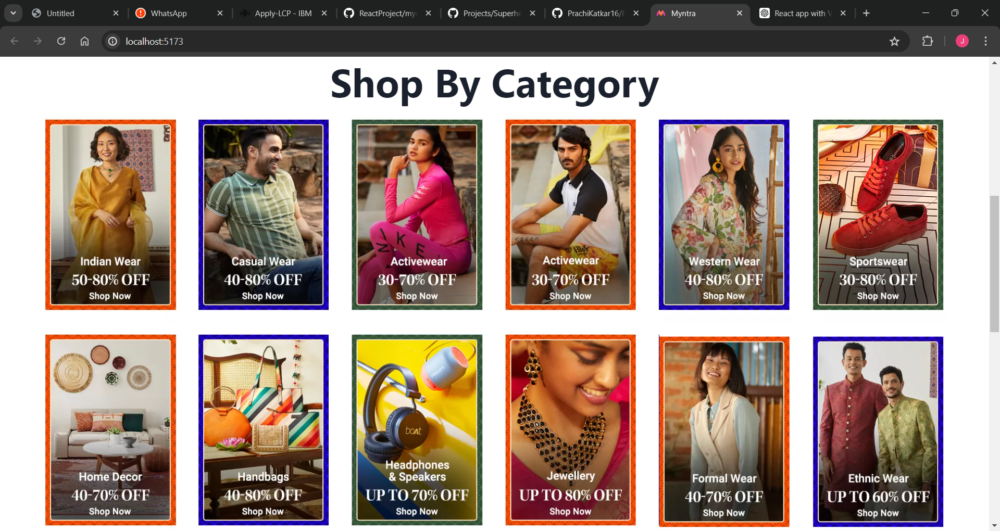
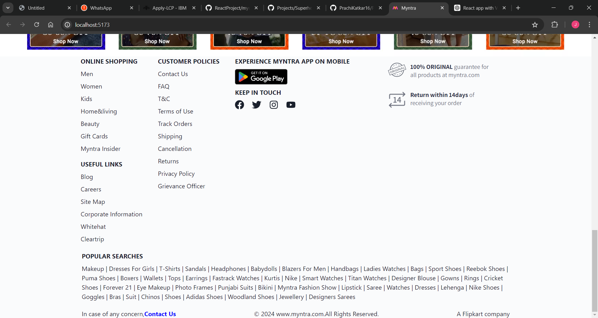
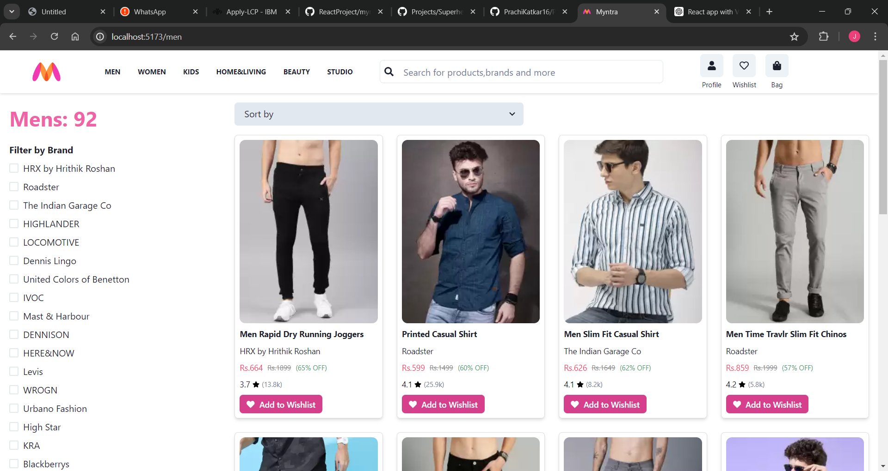
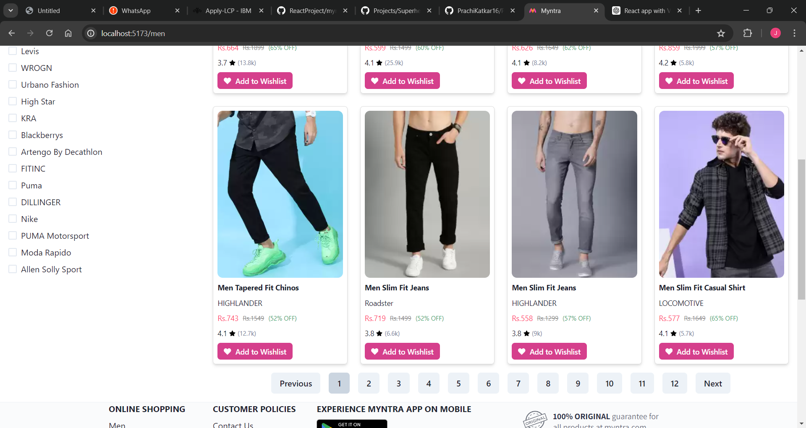
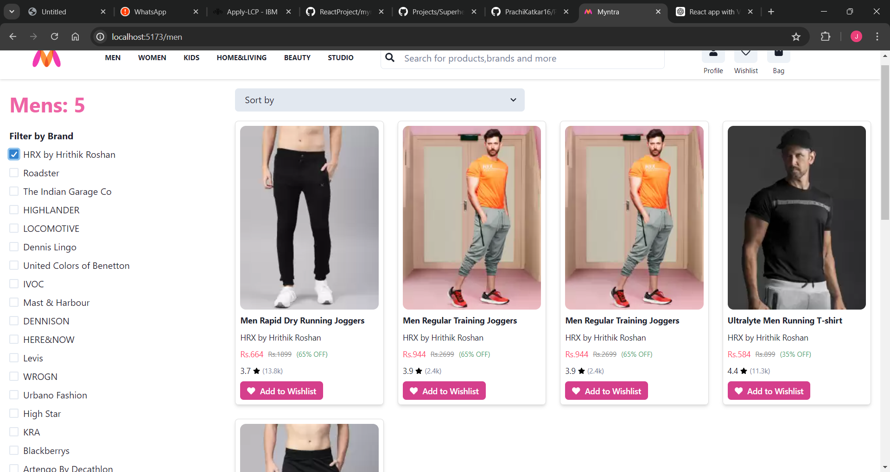
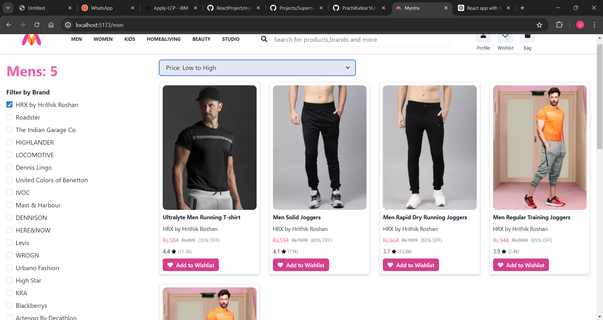
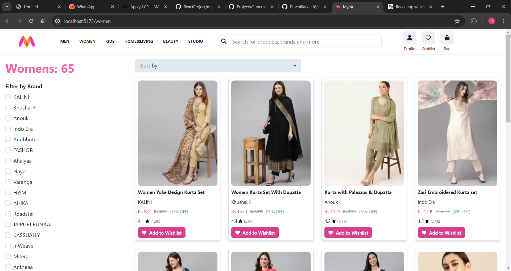
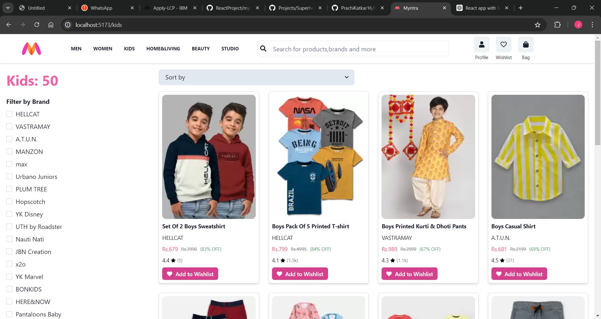
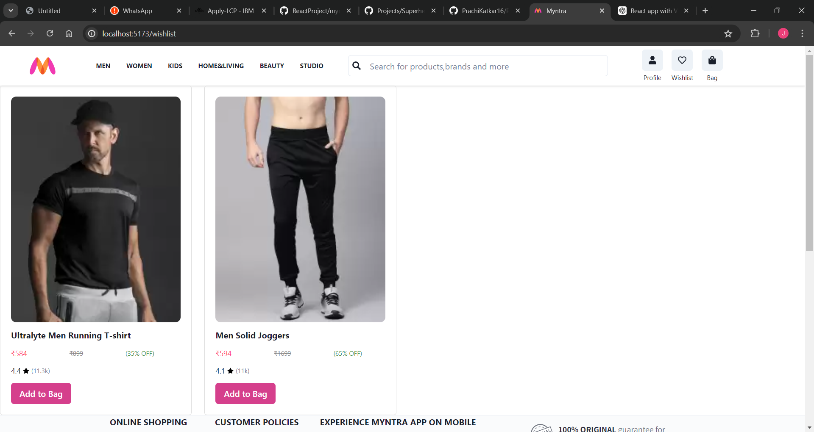

#Myntra clone app using ReactJS

The Myntra Clone App is a ReactJS-based e-commerce web application designed to replicate the features and functionality of the popular online fashion store, Myntra. This project aims to provide users with a seamless online shopping experience, showcasing a wide range of clothing and accessories for men, women, and kids.

Images:

Deployed link:https://6692248f33078dca2724dd53--earnest-phoenix-1bc39b.netlify.app/bag